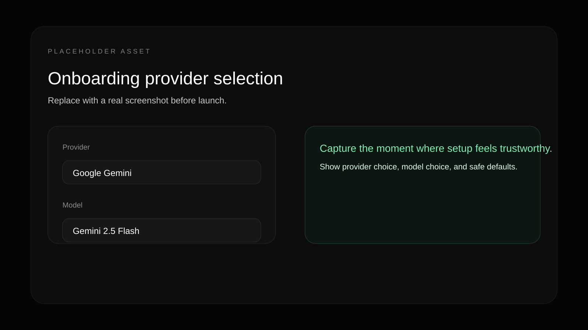
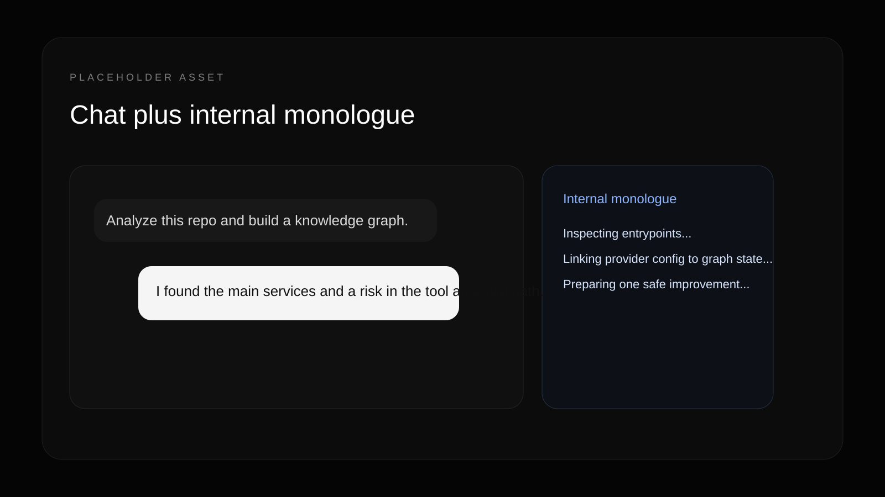
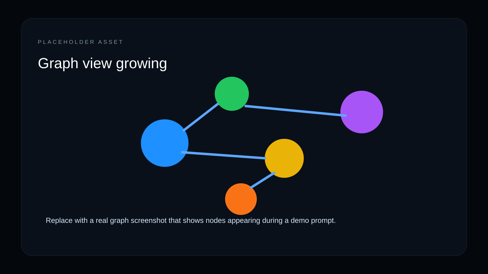
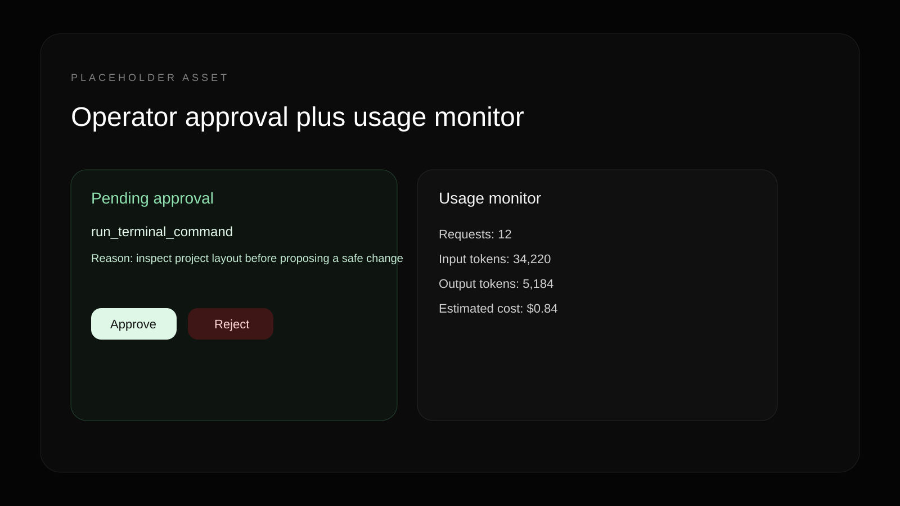

# ARIA

ARIA is a local-first AI agent with a visible brain: persistent memory, a live knowledge graph, governed tool use, and hackable Markdown skills.

It is built for people who want more than chat. You can run it locally, inspect how it reasons, choose your provider and model without editing code, and keep high-impact actions behind operator approval.






## Why ARIA

- Local-first memory and state backed by SQLite.
- A visible graph of what the agent believes.
- Provider and model choice from CLI or web onboarding.
- Operator controls for approvals, usage, Telegram pairing, and remote access.
- Markdown skills that let contributors extend behavior without editing Python.

## See The Visual Brain In 60 Seconds

```bash
git clone https://github.com/0xopenYF/aria.git
cd aria
pip install -e ".[full,dev]"
aria setup
aria web
```

Open [http://127.0.0.1:8000](http://127.0.0.1:8000), then try:

`Analyze this repo and build a knowledge graph of the architecture.`

The demo walkthrough lives in `scripts/demo.py`, and the short recording script lives in [`docs/demo-script.md`](docs/demo-script.md).

## Install Paths

### Terminal Agent

`aria` starts the terminal agent.

```bash
pip install -e ".[full,dev]"
aria setup
aria
```

### Web UI

`aria web` or `aria-web` starts the web UI backed by FastAPI and the static Next.js export.

```bash
aria web
```

The first-run web flow lets you choose a provider, test the key, set safe defaults, and continue into chat.

### Docker Web UI

Docker is the easiest way to demo the visual brain remotely, but it requires an `.env` file.

1. Copy `.env.example` to `.env`.
2. Set:
   - `ARIA_WEB_HOST=0.0.0.0`
   - `ARIA_WEB_API_KEY=<long-random-secret>`
   - one provider API key such as `GEMINI_API_KEY`
3. Start the web profile:

```bash
docker compose --profile web up --build
```

Then open [http://localhost:8000](http://localhost:8000), enter the web API key, and continue through setup.

## Requirements

- Python `>=3.12`
- Node `20` for `aria-ui/`
- Docker optional for containerized web and Telegram deployments

## Useful Commands

```bash
aria doctor
aria models
aria web
aria telegram run
aria telegram pair
python -m build
```

## Provider Support

ARIA currently supports configuration for:

- Gemini
- OpenAI
- Anthropic
- OpenRouter
- DeepSeek
- Mistral
- Groq
- Ollama and local OpenAI-compatible endpoints

Provider settings can come from the setup wizard, `aria setup`, local runtime files in `data/`, or environment variables for headless deployments.

## Safe Defaults

- Tool approvals are on.
- Terminal execution is off.
- Direct code writes are off.
- Background actions are off.
- Remote web binds require `ARIA_WEB_API_KEY`.
- Telegram is deny-by-default until paired.

Read [`SECURITY.md`](SECURITY.md) before exposing ARIA beyond localhost.

## Skills

Skills are the easiest contribution loop in the project.

Add a Markdown file to `skills/`, restart ARIA, and the agent can use that workflow guidance during reasoning. Start with [`skills/repo_researcher.md`](skills/repo_researcher.md) or read [`skills/README.md`](skills/README.md).

### Submit Your First Skill In 5 Minutes

1. Copy an existing file from `skills/`.
2. Rewrite it for one concrete workflow.
3. Test it locally with `aria` or `aria web`.
4. Open a PR or use the skill request template.

## Repository Guide

- Core loop: `aria/core/cognitive_loop.py`
- Providers: `aria/llm/`
- Web backend: `scripts/web_server.py`
- Terminal and admin CLI: `scripts/cli.py`
- Telegram bot: `scripts/telegram_bot.py`
- Web UI: `aria-ui/src/`
- Skills: `skills/`

## Development

```bash
python -m pytest tests
ruff check .
cd aria-ui
npm install
npm run lint
npm run build
```

## Project Docs

- [`CONTRIBUTING.md`](CONTRIBUTING.md)
- [`SECURITY.md`](SECURITY.md)
- [`CODE_OF_CONDUCT.md`](CODE_OF_CONDUCT.md)
- [`ROADMAP.md`](ROADMAP.md)
- [`CHANGELOG.md`](CHANGELOG.md)

## License

Apache-2.0. See [`LICENSE`](LICENSE).
