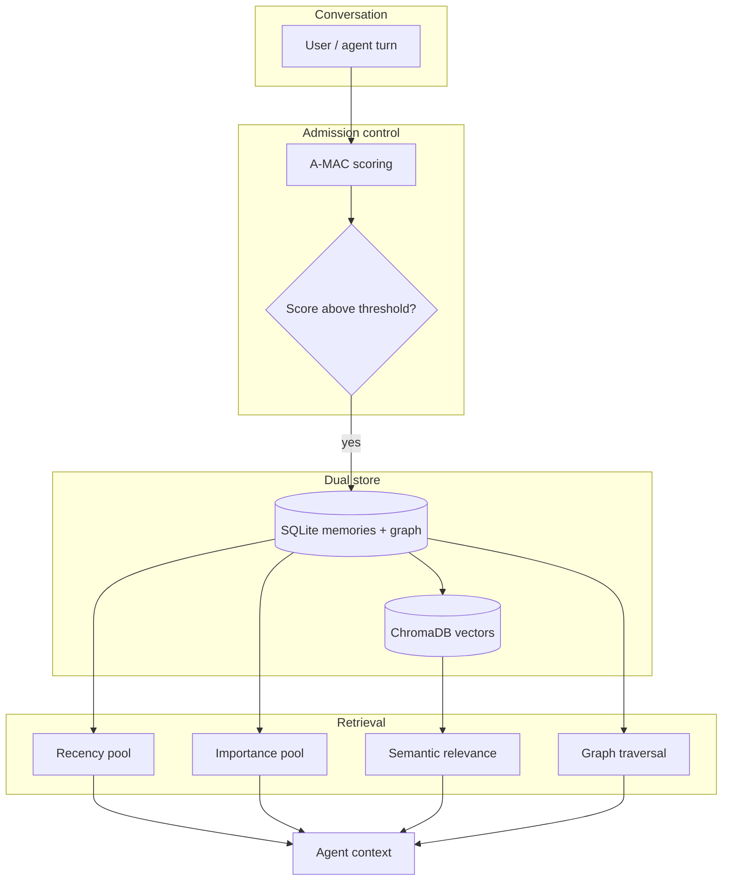

At the core of Kinthic is the **Silex Memory Engine** — a local, persistent memory system built for agents that need to remember across sessions, not just within a context window.

## Architecture overview



## Dual store

Silex persists memories in two complementary backends:

| Store | Role |
|-------|------|
| **SQLite** | Canonical record — content, metadata, importance, timestamps, graph edges, FTS5 keyword search |
| **ChromaDB** | Vector embeddings for semantic similarity recall |

Writes go to SQLite first. Vector upserts happen **after** SQLite commit, with reconciliation on startup to heal any drift.

Data lives under `~/.kinthic/storage/` on your machine. Nothing is sent to a cloud memory service unless you explicitly configure network tools.

## Adaptive Memory Admission Control (A-MAC)

Not every model output should become a memory. Before storing, Silex scores each candidate on five dimensions:

| Dimension | Weight | Purpose |
|-----------|--------|---------|
| Utility | 0.30 | Heuristic value of the information |
| Confidence | 0.30 | Factual alignment with source context |
| Novelty | 0.25 | Semantic distance from existing memories |
| Recency | 0.05 | Time decay factor |
| Type prior | 0.10 | Preference by memory type (fact, preference, plan, etc.) |

Candidates below the composite threshold are **rejected** — keeping the graph clean and reducing noise.

<Info>
  Large payloads (>800 characters) are truncated at admission to preserve graph topology without storing raw tool dumps.
</Info>

## Knowledge graph

Beyond flat retrieval, Silex maintains **entities and relationships** as a graph:

- Entities represent people, projects, concepts, files
- Edges capture relationships (`works_on`, `depends_on`, `prefers`, etc.)
- Graph recall complements vector search for questions like *"How are X and Y connected?"*

This is Kinthic's primary differentiation from agents that only do vector RAG over chat logs.

## Hybrid retrieval

When building context for a turn, Silex assembles memories from multiple pools:

1. **Recency** — recently accessed or created memories
2. **Importance** — high-salience facts and preferences
3. **Relevance** — semantic match to the current query (ChromaDB)
4. **Graph** — neighborhood context around matched entities

Pools are capped by configurable limits to stay within context budgets.

## Consolidation and decay

Over time, Silex:

- **Consolidates** redundant or overlapping memories
- **Decays** importance on stale entries
- **Archives** low-value memories rather than deleting immediately

This keeps recall quality high as your agent accumulates weeks or months of experience.

## Tamper-evident memories

Critical memories can be HMAC-signed. The memory guard middleware detects injection attempts and unauthorized modifications — especially important when skills or external content feed the memory pipeline.

Set strict mode to block untrusted skill content from writing memories:

```bash
export KINTHIC_MEMORY_GUARD_STRICT=1
```

## Beliefs and epistemic state

Kinthic tracks **beliefs** with confidence scores that update and decay over time. The dashboard epistemic graph visualizes this topology — facts the agent holds, how confident it is, and how beliefs relate.

## Trajectory export

Your agent's experience can be exported for fine-tuning:

```bash
kinthic data export --format sft --output trajectories.jsonl
```

This turns operational memory into training data — unique among local agents.

## Expose memory via MCP

Other tools (Claude Desktop, Cursor, even other agents) can use your Kinthic brain:

```bash
kinthic daemon start
kinthic mcp print-config --client claude
```

See [MCP guide](/guides/mcp#serving-silex-memory-mcp-server-mode) for `silex_recall`, `silex_remember`, and graph tools.

## Related

- [Security model](/concepts/security) — memory guard and approval gates
- [CLI reference](/reference/cli) — `kinthic data export`, `kinthic data backup`
- [MCP guide](/guides/mcp)
