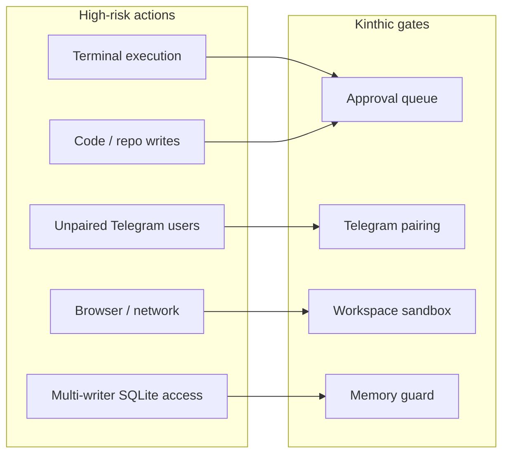

Kinthic is a local AI operator that can read files, browse the web, and — when enabled — execute terminal or code-edit actions. Treat it as **powerful local software**, not a passive chatbot.

## Default posture

By default Kinthic runs with:

| Control | Default |
|---------|---------|
| Tool approvals | **On** |
| Terminal execution | **Off** |
| Direct code application | **Off** |
| Background autonomous actions | **Off** |
| Telegram access | **Deny-by-default** until paired |
| Gateway bind | **Loopback only** (`127.0.0.1`) |

Run `kinthic doctor` to see your current security configuration.

## Threat model

High-risk surfaces:



- **Terminal execution** — arbitrary shell commands on your machine
- **Code editing / repo writes** — persistent changes to your filesystem
- **Browser / network actions** — outbound requests and page fetches
- **Telegram from unpaired users** — remote control of your agent
- **Multi-process SQLite access** — corruption or race on the brain database

## Tool approval gate

Destructive tools are tagged with `requires_approval=True`. When the agent attempts a risky action:

1. Execution **pauses**
2. A pending request appears in the terminal or Telegram
3. You **approve or reject** before anything runs

<Tabs>
  <Tab title="Terminal">
    Approve or reject in the TUI approval overlay when prompted.
  </Tab>
  <Tab title="Telegram">
    ```
    /approvals
    /approve a1b2c3d4
    /reject a1b2c3d4
    ```
    Approvals time out after **120 seconds** — the action is treated as rejected.
  </Tab>
</Tabs>

MCP tools listed under `requires_approval` in `~/.kinthic/config/mcp.yaml` follow the same gate.

## Telegram pairing

Kinthic uses **deny-by-default** Telegram access:

1. Configure a bot token during `kinthic init`
2. Start the bot: `kinthic channels telegram run`
3. Pair your account via the wizard deep-link or `kinthic channels telegram pair`
4. Unpaired users are rate-limited (5 attempts/minute) and cannot issue commands

Remote commands like `/whoami`, `/status`, `/skills`, and `/approvals` require a paired session.

See [Telegram guide](/guides/telegram).

## Workspace sandbox

File reads and writes are scoped to the workspace boundary (`SILEX_WORKSPACE`, defaulting to your project directory). The code editor and filesystem tools respect this sandbox unless explicitly overridden.

## Memory guard

The memory guard middleware protects against:

- Prompt injection into memory writes
- Tampering with signed memories
- Untrusted skill content writing to the brain

Skills from KinthicHub carry a `trust_level`:

| Level | Meaning |
|-------|---------|
| `core` | Bundled with Kinthic, HMAC-verified |
| `verified` | Community skill signed by maintainers |
| `community` | User-submitted, sandboxed by default |

Enable strict mode to reject untrusted memory writes:

```bash
export KINTHIC_MEMORY_GUARD_STRICT=1
```

## Security-relevant environment variables

| Variable | Default | Purpose |
|----------|---------|---------|
| `SILEX_WORKSPACE` | Current directory | Sandbox boundary for file reads/writes |
| `SILEX_ENABLE_CODE_APPLY` | `false` | Auto-approve code edits |
| `SILEX_ENABLE_TERMINAL_EXECUTION` | `false` | Allow terminal commands |
| `SILEX_REQUIRE_TOOL_APPROVALS` | `true` | Require human approval for destructive tools |
| `KINTHIC_MEMORY_GUARD_STRICT` | unset | Block untrusted skill memory writes |

## Deployment guidance

- Prefer **one writer process** per `~/.kinthic` data directory
- Use `kinthic daemon install` for a supervised single gateway — avoid running multiple writers
- Pair Telegram instead of enabling public/open mode
- Review pending approvals before high-impact actions
- Back up regularly: `kinthic data backup`

## Reporting vulnerabilities

Do **not** open public GitHub issues for exploitable vulnerabilities.

Report via GitHub private vulnerability reporting or email `security@openyf.dev` with:

- Affected version or commit
- Reproduction steps
- Impact assessment

Full policy: [SECURITY.md on GitHub](https://github.com/openyfai/kinthic/blob/main/SECURITY.md).

## Related

- [Memory engine](/concepts/memory)
- [Telegram guide](/guides/telegram)
- [MCP security defaults](/guides/mcp#security-defaults)
