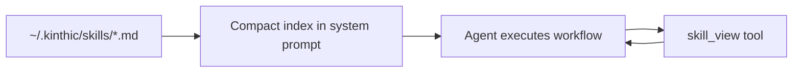

Skills are the simplest way to extend Kinthic. Drop a Markdown file into `~/.kinthic/skills/` and the cognitive engine absorbs a new workflow — **no Python required**.

## How skills work



1. Skills appear as a **compact index** in the system prompt (name + trigger)
2. When a task matches, the agent calls `skill_view` to load full instructions
3. Mark `inline: true` to inject the full body every turn (use sparingly)

## Quick start

```bash
kinthic skills list
kinthic skills search research
kinthic skills install repo_onboard
kinthic skills reload
```

Inside a session: `:skills` and `:plugin reload`.

## Flat skill (simplest)

Create `~/.kinthic/skills/my_skill.md`:

```markdown
# My Skill Title

## When to use
Describe the trigger: what user request should activate this skill.

## Workflow
1. Step one.
2. Step two.
3. Step three.

## Output
Describe the expected output format.
```

Then:

```bash
kinthic skills reload
```

## Nested skill (with metadata)

```
~/.kinthic/skills/my_skill/
├── SKILL.md        ← required
└── skill.yaml      ← optional metadata
```

`skill.yaml` example:

```yaml
name: my_skill
type: skill
version: "1.0.0"
description: "One-line description."
author: "Your Name"
tags: [research, writing]
trust_level: community
trigger: "When user asks to summarize a document"
inline: false
```

## KinthicHub catalog

Browse and install from the remote catalog:

```bash
kinthic skills search docker
kinthic skills install <name>
kinthic skills refresh    # merge remote catalog updates
```

Catalog spec: hosted at `https://kinthic.openyf.dev/registry/catalog.yaml`.

Offline installs still work via the bundled catalog copied during install.

## Trust levels

| Level | Description |
|-------|-------------|
| `core` | Shipped with Kinthic, HMAC-verified |
| `verified` | Community skill signed by maintainers |
| `community` | User-submitted, runs in sandbox |

Imported skills from migration (`kinthic data migrate`) are marked `community` by default.

## When to use skills vs other extensions

| Need | Use |
|------|-----|
| Reusable LLM instructions | **Skill** (Markdown) |
| Python code the agent calls | Tool plugin (`~/.kinthic/plugins/tools/`) |
| External service (GitHub, filesystem) | [MCP server](/guides/mcp) |
| New LLM backend | Provider plugin |

## CLI reference

| Command | Purpose |
|---------|---------|
| `kinthic skills list` | List catalog and loaded skills |
| `kinthic skills search <query>` | Search KinthicHub |
| `kinthic skills install <name\|url>` | Install skill |
| `kinthic skills uninstall <name>` | Remove skill |
| `kinthic skills show <name>` | Print full markdown body |
| `kinthic skills reload` | Reload from disk |
| `kinthic skills refresh` | Fetch remote catalog |

## Submitting skills

Use the [Skill Submission issue template](https://github.com/openyfai/kinthic/issues/new/choose) on GitHub. Submitted skills undergo a security audit before catalog inclusion.

For plugin development beyond skills, see the [PLUGIN_DEVELOPMENT.md](https://github.com/openyfai/kinthic/blob/main/docs/PLUGIN_DEVELOPMENT.md) guide in the repository.

## Related

- [Getting started](/start/getting-started)
- [Security model](/concepts/security)
- [CLI reference](/reference/cli)
