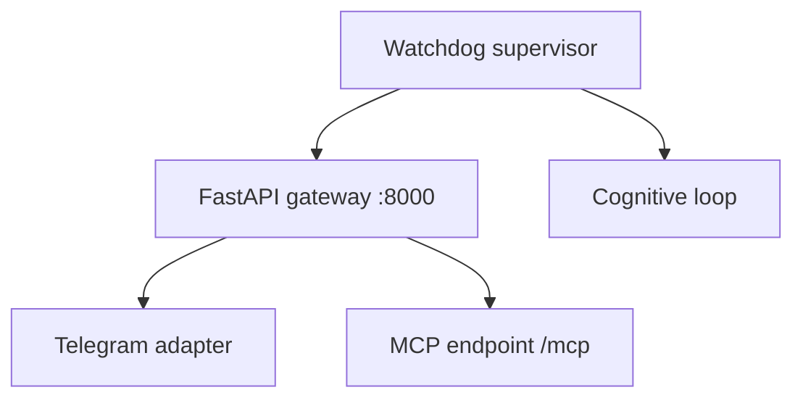

The Kinthic **daemon** runs the gateway (FastAPI server), cognitive loop, channel adapters, and MCP endpoint as a supervised background process.

## When to use the daemon

| Mode | Command | Use case |
|------|---------|----------|
| Interactive | `kinthic` | Terminal TUI sessions |
| Foreground supervisor | `kinthic daemon run` | Debugging, watching logs |
| Background | `kinthic daemon start` | Manual background run |
| System service | `kinthic daemon install` | Survives reboot (systemd / LaunchAgent) |

## Quick start

```bash
kinthic daemon install    # one-time: register systemd/LaunchAgent unit
kinthic daemon start      # start the supervisor
kinthic daemon status     # check if running
kinthic daemon logs       # tail logs
```

Stop and remove:

```bash
kinthic daemon stop
kinthic daemon uninstall  # remove service unit
```

## What the daemon runs



The gateway binds to **loopback by default** (`127.0.0.1:8000`). Configure via `~/.kinthic/.env`:

```bash
KINTHIC_GATEWAY_HOST=127.0.0.1
KINTHIC_GATEWAY_PORT=8000
```

## Service installation

`kinthic daemon install` writes a user-level service:

- **Linux** — `~/.config/systemd/user/kinthic.service`
- **macOS** — LaunchAgent plist in `~/Library/LaunchAgents/`

Enable lingering on Linux so the service runs without an active login session:

```bash
loginctl enable-linger $USER
systemctl --user enable kinthic
systemctl --user start kinthic
```

Use `--force` to overwrite an existing unit:

```bash
kinthic daemon install --force
```

## Dashboard and web UI

With the daemon running:

```bash
kinthic web
```

Opens the local Next.js dashboard for epistemic graph, metrics, and engine settings.

## MCP server mode

The daemon exposes Silex memory at `http://127.0.0.1:8000/mcp` when running. See [MCP guide](/guides/mcp#serving-silex-memory-mcp-server-mode).

## Single-writer rule

<Warning>
  Run **one daemon instance** per `~/.kinthic` data directory. Multiple writers corrupt SQLite and cause approval race conditions.
</Warning>

## Troubleshooting

| Issue | Fix |
|-------|-----|
| `daemon status` shows stopped | `kinthic daemon start` or check `kinthic daemon logs` |
| Port 8000 in use | Change `KINTHIC_GATEWAY_PORT` in `.env` |
| Service not surviving reboot | Run `kinthic daemon install` and enable user lingering (Linux) |
| Telegram not responding | Ensure daemon is running; see [Telegram guide](/guides/telegram) |

## Related

- [Getting started](/start/getting-started)
- [Telegram](/guides/telegram)
- [Troubleshooting](/help/troubleshooting)
