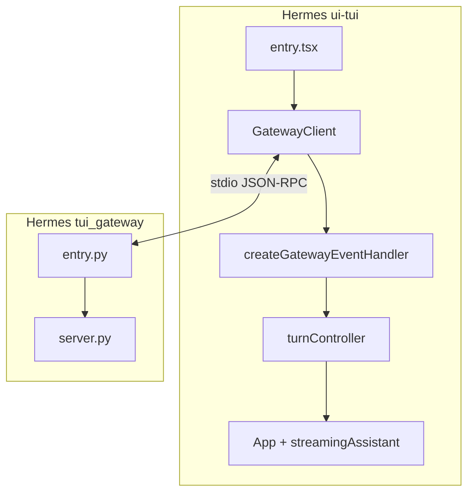
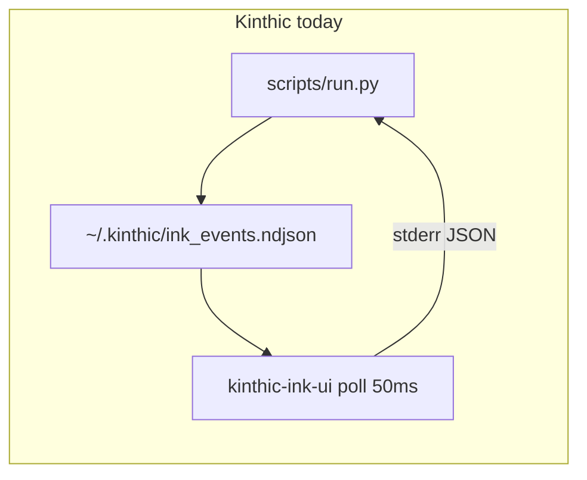

# Hermes TUI Study — Kinthic Adoption Reference

Comparison of [Hermes Agent](file:///E:/hermes%20agent%20clone/hermes-agent) `ui-tui` + `tui_gateway` vs Kinthic Ink, and what Kinthic adopted in Phase A.

## Architecture

| Concern | Hermes | Kinthic (Phase A) |
|---------|--------|------------------|
| Transport | stdio JSON-RPC gateway subprocess | NDJSON file bus (Phase B candidate) |
| Live activity | `turnController` single buffer | `ThinkingSpinner` + `state.thinking` |
| Transcript | user + assistant only when done | Ledger + collapse rules in `prepareDisplayLedger` |
| Events | `GatewayEvent` union | `TurnEvent` / `turn_event` wire type |

## Event mapping: Hermes GatewayEvent ↔ Kinthic TurnPhase

| Hermes event | Kinthic TurnPhase | Notes |
|--------------|------------------|-------|
| `message.start` / `message.delta` | `response` (Kinthic title) + `stream` legacy | Hermes streams deltas; Kinthic batch + typewriter |
| `message.complete` | `response` + summary | |
| `thinking.delta` / `reasoning.delta` | `routing`, `context`, `response` | Kinthic feeds `ThinkingSpinner`, not ledger rows |
| `tool.start` / `tool.progress` / `tool.complete` | `tool` | |
| `approval.request` / respond RPC | `approval` | Overlay via `ApprovalPrompt` |
| `subagent.*` | `subagent` | Maps to `WorkerLedgerRow` |
| `status.update` | `routing` stub | Kinthic emits pre-process routing from `run.py` |
| `error` | `error` | |
| (telemetry footer) | `summary` | One line per `turn_id` after Phase A |
| — | `memory` | Post-turn memory writes |
| — | `user` | User message |

## File mapping

| Hermes | Kinthic equivalent | Gap |
|--------|-------------------|-----|
| `ui-tui/src/gatewayClient.ts` | `silex/ui/ink_bridge.py` + `index.tsx` poller | No stdio push yet |
| `ui-tui/src/app/createGatewayEventHandler.ts` | `kinthic-ink-ui/src/state.ts` `reduceAppState` | |
| `ui-tui/src/app/turnController.ts` | `ThinkingSpinner.tsx` + `applyTurnEventSideEffects` | |
| `ui-tui/src/components/streamingAssistant.tsx` | `StreamingLedgerRow` + `ActivityLedger` | |
| `ui-tui/src/components/prompts.tsx` | `ApprovalPrompt.tsx`, `FileEditApprovalPrompt.tsx` | |
| `ui-tui/src/components/appChrome.tsx` | `PromptRow.tsx` hints only | No status ticker |
| `tui_gateway/server.py` | `scripts/run.py` + `TurnEmitter` | |
| `silex/ui/turn_emitter.py` | (Kinthic-native) | |

## Do not port (unless explicitly wanted)

- Full `ui-tui` transcript layout (~300 files)
- `@hermes/ink` fork (alternate screen, mouse, virtual scroll) — Phase C
- Voice input, model picker modal, agents overlay tree
- Skin/branding system, FaceTicker kaomoji bar
- Message queue while busy (`busy_input_mode: queue`)
- WebSocket attach mode before stdio gateway works

## Phase A changes (implemented)

1. **Instant feedback** — `ThinkingSpinner` on submit; pre-process `routing` stub from Python
2. **Live slot** — thinking phases update `state.thinking` only; no ledger row spam
3. **Clean finished view** — per-turn `prepareDisplayLedger` collapse; memory/telemetry after assistant
4. **Emission order** — `assistant_done` → `memory` → `turn_summary`
5. **Single bus** — `mirror_legacy=False`; no redundant `emit_approval_resolved`

## Phase B evaluation checklist

After using Phase A daily, consider stdio JSON-RPC gateway if:

- [ ] First activity still feels >200ms delayed after Enter (excluding LLM)
- [ ] File poll causes missed or out-of-order events under load
- [ ] You need bidirectional RPC (interrupt, session resume) without stderr hacks

If Phase A feels responsive enough, **keep NDJSON** — correctness is fine; gateway is optimization.

**Decision log**

| Date | Phase A shipped | Phase B needed? | Notes |
|------|-----------------|-----------------|-------|
| 2026-06-06 | Yes | Partial TCP only | Phase B shipped localhost TCP push (`KINTHIC_EVENTS_PORT`); file poll remains fallback. Full Hermes stdio gateway deferred — instant submit feedback + emission order fixes addressed main UX gaps. |

## Priority Hermes files for future study

1. `ui-tui/src/gatewayClient.ts` — spawn, buffer, drain
2. `ui-tui/src/app/turnController.ts` — stream batching, reset
3. `tui_gateway/server.py` — emit points, approval hook
4. `website/docs/user-guide/tui.md` — UX spec
